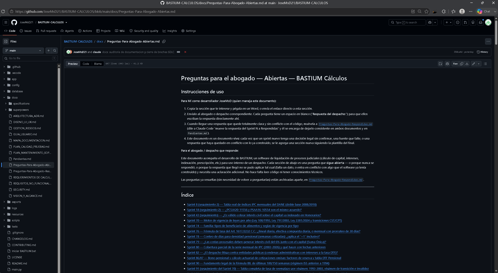
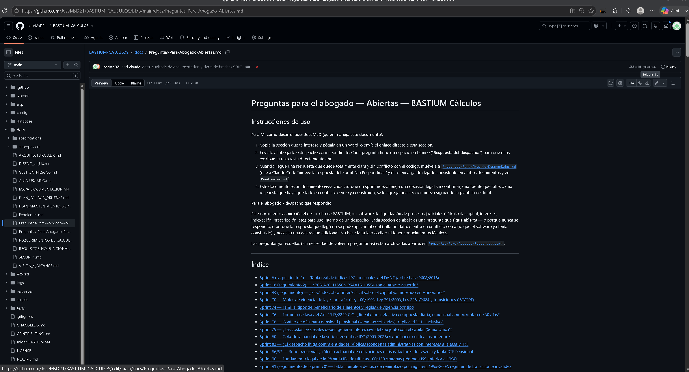
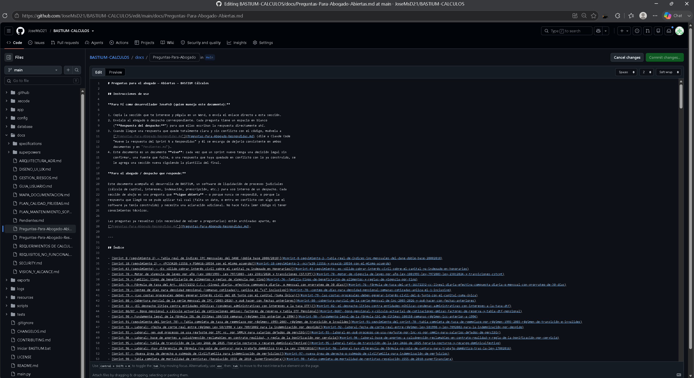
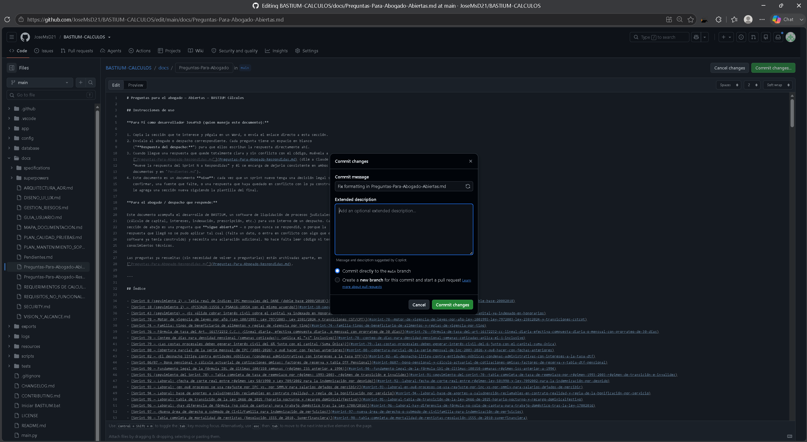

# Preguntas para el abogado — Abiertas — BASTIUM Cálculos

## Instrucciones de uso

**Para Mí como desarrollador JoseMsD (quien maneja este documento):**

1. Copia la sección que te interese y pégala en un Word, o envía el enlace directo a esta sección.
2. Envíalo al abogado o despacho correspondiente. Cada pregunta tiene un espacio en blanco
   ("**Respuesta del despacho:**") para que ellos escriban la respuesta directamente ahí.
3. Cuando llegue una respuesta que quede totalmente clara y sin conflicto con el código, muévela a
   [`Preguntas-Para-Abogado-Respondidas.md`](Preguntas-Para-Abogado-Respondidas.md) (dile a Claude Code
   "mueve la respuesta del Sprint N a Respondidas" y él se encarga de dejarlo consistente en ambos
   documentos y en `Pendientes.md`).
4. Este documento es un documento **vivo**: cada vez que un sprint nuevo tenga una decisión legal sin
   confirmar, una fuente que falte, o una respuesta que haya quedado en conflicto con lo ya construido, se
   le agrega una sección nueva siguiendo la plantilla del final.

**Para el abogado / despacho que responde:**

Este documento acompaña el desarrollo de BASTIUM, un software de liquidación de procesos judiciales
(cálculo de capital, intereses, indexación, prescripción, etc.) para uso interno de un despacho. Cada
sección de abajo es una pregunta que **sigue abierta** — o porque nunca se respondió, o porque la
respuesta que llegó no se pudo aplicar tal cual (falta un dato, o entra en conflicto con algo que el
software ya tenía construido) y necesita una aclaración adicional. No hace falta leer código ni tener
conocimientos técnicos.

Las preguntas ya resueltas (sin necesidad de volver a preguntarlas) están archivadas aparte, en
[`Preguntas-Para-Abogado-Respondidas.md`](Preguntas-Para-Abogado-Respondidas.md).

### Cómo guardar tu respuesta en GitHub (paso a paso)

Una vez hayas escrito tus respuestas directamente en este documento dentro de GitHub, sigue estos pasos
para guardarlas correctamente. Esto deja tu respuesta lista para que yo (JoseMsD) la revise y la apruebe
antes de que quede incorporada de forma definitiva — no se publica sola apenas la guardas.

1. **Abre el archivo en GitHub.** Entra al repositorio y ubica `docs/Preguntas-Para-Abogado-Abiertas.md`.
   Verás el documento en modo lectura, con las pestañas **Preview / Code / Blame** arriba del contenido.

   

2. **Haz clic en el ícono del lápiz (✏️)**, ubicado en la esquina superior derecha del visor de archivo
   (junto a los íconos de copiar/descargar). Al pasar el mouse por encima aparece el mensaje
   "**Edit this file**". Haz clic ahí para entrar al modo de edición.

   

3. **Escribe tu respuesta** en el espacio en blanco que dice "**Respuesta del despacho:**", justo debajo de
   cada pregunta que estés contestando. No borres ni modifiques las preguntas, encabezados o enlaces del
   resto del documento — agrega tu texto únicamente en el espacio indicado. Puedes usar la pestaña
   **Preview** (arriba del editor) para revisar cómo se ve tu respuesta antes de continuar.

   

4. **Cuando termines, haz clic en el botón verde "Commit changes..."** (arriba a la derecha del editor).
   Se abrirá una ventana emergente para confirmar el guardado.

5. **En el campo "Commit message"**, borra el texto que sugiere GitHub y escribe algo que identifique
   claramente qué respondiste, por ejemplo:
   `Respuestas Sprint 82 y 90 - [tu nombre o el del despacho]`
   En "Extended description" puedes agregar, opcionalmente, una nota breve como "Se respondieron 2
   preguntas pendientes."

6. **Muy importante — selecciona la segunda opción**, "**Create a new branch for this commit and start a
   pull request**" (en vez de "Commit directly to the main branch", que viene marcada por defecto). Esto
   es lo que permite que yo vea tu respuesta como una propuesta de cambio y la apruebe antes de que se una
   al documento oficial. Puedes dejar el nombre de rama que GitHub sugiere automáticamente.

   

7. **Haz clic en "Propose changes"** para confirmar. GitHub te llevará automáticamente a la pantalla de
   creación del Pull Request — ahí haz clic en "**Create pull request**" para enviarlo.

8. **Listo.** Recibiré una notificación del Pull Request y podré revisar exactamente qué agregaste
   (resaltado en verde frente al texto original). Si la respuesta queda clara y sin conflicto con el
   código, la apruebo y la fusiono ("merge") al documento oficial. Si necesito una aclaración adicional, te
   la pido ahí mismo como comentario dentro del mismo Pull Request.

---

## Índice

- [Sprint 8 (seguimiento 3) — Tabla real de IPC mensual anterior a enero de 2003](#sprint-8-seguimiento-3--tabla-real-de-ipc-mensual-anterior-a-enero-de-2003)
- [Sprint 18 (seguimiento 3) — Discrepancia numérica entre la tabla granular verificada (PSAA16-10554) y las "tarifas duras" que aportó el despacho](#sprint-18-seguimiento-3--discrepancia-numérica-entre-la-tabla-granular-verificada-psaa16-10554-y-las-tarifas-duras-que-aportó-el-despacho)
- [Sprint 70/91 (seguimiento) — Fechas exactas de vigencia por régimen, invalidez Grado 1, y "régimen de transición"](#sprint-7091-seguimiento--fechas-exactas-de-vigencia-por-régimen-invalidez-grado-1-y-régimen-de-transición)
- [Sprint 76 — Fórmula de tasa del Art. 1617/2232 C.C.: ¿lineal diaria, efectiva compuesta diaria, o mensual con prorrateo de 30 días?](#sprint-76--fórmula-de-tasa-del-art-16172232-cc-lineal-diaria-efectiva-compuesta-diaria-o-mensual-con-prorrateo-de-30-días)
- [Sprint 79 — ¿Las costas procesales deben generar interés civil del 6% junto con el capital (Suma Única)?](#sprint-79--las-costas-procesales-deben-generar-interés-civil-del-6-junto-con-el-capital-suma-única)
- [Sprint 82 (seguimiento) — ¿En qué área de BASTIUM vive el calculador de condenas administrativas (DTF)?](#sprint-82-seguimiento--en-qué-área-de-bastium-vive-el-calculador-de-condenas-administrativas-dtf)
- [Sprint 84 (seguimiento) — Imputación proporcional (Art. 804 E.T.) y tope suspensivo por demanda contenciosa](#sprint-84-seguimiento--imputación-proporcional-art-804-et-y-tope-suspensivo-por-demanda-contenciosa)
- [Sprint 86/87 (seguimiento) — Tabla actuarial completa (FAC1/FAC2), serie DTF Pensional, y cuál fórmula de FAC3 es la correcta](#sprint-8687-seguimiento--tabla-actuarial-completa-fac1fac2-serie-dtf-pensional-y-cuál-fórmula-de-fac3-es-la-correcta)
- [Sprint 94 (seguimiento) — aporte a salud en contrato realidad, y si el Decreto 0320/2026 reemplaza la regla de bonificación por servicio de la plantilla L8](#sprint-94-seguimiento--aporte-a-salud-en-contrato-realidad-y-si-el-decreto-03202026-reemplaza-la-regla-de-bonificación-por-servicio-de-la-plantilla-l8)
- [Sprint 95 (seguimiento) — porcentajes de los 4 conceptos "Horas Extras..." (HED, HEN, HEFD, HEFN) tras la Ley 2466/2025](#sprint-95-seguimiento--porcentajes-de-los-4-conceptos-horas-extras-hed-hen-hefd-hefn-tras-la-ley-24662025)
- [Sprint 96 — Laboral: ¿hay diferencia de fórmula (no solo de captura) para trabajo doméstico tras la Ley 1788/2016?](#sprint-96--laboral-hay-diferencia-de-fórmula-no-solo-de-captura-para-trabajo-doméstico-tras-la-ley-17882016)
- [Sprint 97 — ¿Nueva área de derecho o submodo de Civil/Familia para indemnización de perjuicios?](#sprint-97--nueva-área-de-derecho-o-submodo-de-civilfamilia-para-indemnización-de-perjuicios)
- [Sprint 98 — Tabla completa de mortalidad de rentistas (Resolución 1555 de 2010, Superfinanciera)](#sprint-98--tabla-completa-de-mortalidad-de-rentistas-resolución-1555-de-2010-superfinanciera)
- [Sprint 102 — Ejemplo numérico resuelto de indexación con abonos (X9)](#sprint-102--ejemplo-numérico-resuelto-de-indexación-con-abonos-x9)
- [Plantilla para sprints futuros](#plantilla-para-sprints-futuros)

---

## Sprint 8 (seguimiento 3) — Tabla real de IPC mensual anterior a enero de 2003

**Contexto:** el despacho ya respondió la pregunta de seguimiento 2 (ver
`Preguntas-Para-Abogado-Respondidas.md`, Sprint 8) con las fórmulas de "Límite de Vacío Absoluto" (fechas
anteriores al 01/08/1954 → índice 1.000000) y "Estimación Futura" (media geométrica de los últimos 12
meses para fechas posteriores al último mes certificado) — ambas ya implementadas y probadas. La
respuesta también afirma que la serie bajo la base Diciembre 2008 = 100 "tiene continuidad ininterrumpida
desde décadas anteriores a 2003" y que "no existe un vacío real en los datos mensuales". Sin embargo, el
único archivo con datos reales de IPC mensual accesible para el desarrollo (`ipc_mensual_dane_2003_2026.csv`
en `docs/datos_publicos_fuente/`, extraído programáticamente del Excel que aportó el despacho) solo cubre
enero de 2003 en adelante, base Diciembre 2018 = 100. Para fechas anteriores a 2003 (y, en particular,
para el tramo 1954-08 a 1966, donde tampoco hay variación anual cargada en `_IPC_VARIACION_ANUAL`), el
software sigue sin ningún índice mensual real, y la interpolación anual (que cubre 1967-2025) tampoco
llega hasta 1954.

**Pregunta:** ¿puede el despacho aportar la tabla real de índices IPC mensuales (base Diciembre 2008 = 100,
o cualquier base con su factor de enlace) para el período 01/08/1954 a diciembre de 2002 — el mismo tipo
de archivo (Excel/CSV) que ya aportaron para 2003-2026?

**Qué necesito exactamente:** igual que con la serie 2003-2026, un archivo con un valor de índice por mes
(no variación %), cubriendo desde agosto de 1954 (o el año más antiguo disponible) hasta diciembre de
2002. Si la fuente exacta que menciona el despacho no está en un archivo descargable, sirve la referencia
(nombre de la publicación DANE, o el enlace) para extraerla directamente.

**Respuesta del despacho:**

**Fecha:**
---

## Sprint 18 (seguimiento 3) — Discrepancia numérica entre la tabla granular verificada (PSAA16-10554) y las "tarifas duras" que aportó el despacho

**Contexto:** la pregunta de seguimiento 2 (¿PCSJA20-11556 y PSAA16-10554 son el mismo acuerdo?) ya se
contestó (22/08/2026, ver `Preguntas-Para-Abogado-Respondidas.md`, Sprint 18): el despacho confirmó que
"el marco tarifario unificado obligatorio se rige por el Acuerdo PSAA16-10554" — coincide exactamente con
lo ya implementado y verificado contra la fuente oficial (ramajudicial.gov.co), así que no hubo que tocar
código por ese punto. La misma respuesta también confirmó, sin ambigüedad, que las agencias en derecho se
tasan con "ponderación inversa: a mayor valor, menor porcentaje, respetando los topes" — exactamente la
aproximación que ya usa `_interpolar_dentro_de_rango` (`app/engine/costs/agencias_en_derecho.py`), citando
el mismo fundamento (Parágrafo 3, Art. 3 del Acuerdo). Ninguno de esos dos puntos requiere cambio de
código.

La respuesta agregó además, bajo el encabezado "Qué podría hacerse", una tabla de "tarifas duras" para 3
categorías (Procesos Declarativos, Procesos Ejecutivos, Sucesiones y Liquidaciones) con rangos min/max que
**no coinciden** con los ya transcritos en `TARIFAS_AGENCIAS_EN_DERECHO` desde el texto oficial del Acuerdo
(ej. la respuesta da "Procesos Declarativos, Primera Instancia, Mayor Cuantía: 0.03-0.075", un rango
distinto al que trae la tabla granular actual para esa misma categoría). Como la tabla granular actual fue
verificada independientemente contra la fuente oficial del acuerdo, y como el propio despacho ya se
equivocó una vez citando un número de acuerdo inexistente ("PCSJA20-11556", Sprint 18 original) y ahora
enmarca esta tabla como una sugerencia tentativa ("por ahora se sabe", "qué **podría** hacerse", no una
instrucción categórica de reemplazo), esta rutina NO sobrescribió la tabla ya verificada con estos números
nuevos — el riesgo de introducir una cifra legal incorrecta sin una fuente primaria que la respalde es
mayor que el de dejar la pregunta abierta.

**Pregunta:** ¿la tabla de "tarifas duras" de la respuesta del 22/08/2026 debe **reemplazar** la tabla
granular ya implementada (transcrita y verificada contra el texto oficial del Acuerdo PSAA16-10554 en
ramajudicial.gov.co), o es una aproximación/resumen que no debe usarse tal cual? Si debe reemplazarla,
¿pueden confirmar la fuente exacta de esos números (para volver a verificarlos contra el texto oficial
antes de tocar el motor de cálculo)?

**Qué necesito exactamente:** un sí/no sobre si se reemplaza la tabla granular actual, y si es sí, el
artículo/página exacto del Acuerdo (o la fuente que corresponda) de donde salen esos rangos, para
verificarlos igual que se hizo con la tabla que ya está implementada.

**Respuesta del despacho:**

**Fecha:**
---

## Sprint 70/91 (seguimiento) — Fechas exactas de vigencia por régimen, invalidez Grado 1, y "régimen de transición"

**Contexto:** la respuesta del despacho del 22/08/2026 (ver `Preguntas-Para-Abogado-Respondidas.md`,
"Sprint 70/91") confirmó 4 fórmulas de tasa de reemplazo pensional que ya se implementaron y probaron como
funciones aisladas en `app/engine/labor/ibl.py` (régimen 1985-1989, ISS Pre-Ley 100/Acuerdo 049-1990, Ley
100 original 1994-2003, e invalidez grado 2). Quedaron 3 puntos sin resolver que esta rutina no adivinó:

1. **Fechas exactas de vigencia de cada régimen** — la respuesta pidió un patrón "Factory" que enrute el
   cálculo por fecha de los hechos, pero no dio el día exacto en que empieza/termina cada régimen (solo
   rangos aproximados como "1985-1989" o "Pre-Ley 100"). Sin esa fecha exacta, no se construyó el router:
   enrutar una liquidación real a un régimen equivocado por una fecha de corte mal supuesta sería un error
   de dominio grave.
2. **Invalidez Grado 1** — esta respuesta da un tope de 60%, pero una fuente anterior (plantilla comercial
   P9 del despacho, con cifras concretas verificadas: 500 semanas→45,0%, ...,1500 semanas→75,0%, Sprint 91)
   ya había confirmado un tope de 75% para el mismo grado. No se implementó ninguna función para Grado 1
   mientras esta discrepancia no se resuelva.
3. **"Régimen de transición"** (Art. 36 Ley 100 de 1993, tasa fija "75%/90%/la que corresponda") — la
   pregunta original del Sprint 91 lo pedía por ese nombre; la respuesta del 22/08 no lo menciona
   explícitamente. No está claro si "Régimen 1985-1989" es la respuesta a esto, o si sigue sin contestar.

**Pregunta:** (1) ¿cuál es la fecha exacta de entrada en vigencia y de cese de cada régimen (1985-1989, ISS
Pre-Ley 100/Acuerdo 049 de 1990, Ley 100 original, Ley 797/2003)? (2) Para invalidez Grado 1, ¿el tope
correcto es 60% (esta respuesta) o 75% (la plantilla P9)? (3) ¿El "régimen de transición" del Art. 36 Ley
100/1993 (con sus reglas propias de quién puede acogerse) es un régimen aparte de los ya confirmados, o se
resuelve con la tabla de "Régimen 1985-1989"/"ISS Pre-Ley 100" ya dada?

**Qué necesito exactamente:** una tabla de régimen → fecha desde → fecha hasta (o "vigente"), la
confirmación del tope de invalidez Grado 1, y la aclaración sobre el régimen de transición.

**Respuesta del despacho:**

**Fecha:**
---

## Sprint 76 — Fórmula de tasa del Art. 1617/2232 C.C.: ¿lineal diaria, efectiva compuesta diaria, o mensual con prorrateo de 30 días?

**Contexto (explicado desde cero, para quien no haya visto el código):**

El Artículo 1617 del Código Civil dice que, cuando un contrato no pactó una tasa de interés, se debe el
**6% anual**. El software necesita liquidar día por día (para saber exactamente cuánto interés se debe
en cualquier fecha, no solo al cierre de cada año), así que ese 6% anual tiene que convertirse primero en
una **tasa diaria equivalente**. El problema es que existen dos formas matemáticas distintas — y
legalmente distintas — de hacer esa conversión, y dan números diferentes.

**Opción A — Lineal (o "nominal"), la fórmula que trae el documento de requisitos:**

Es la división simple: `tasa_diaria = 6% ÷ 365 = 0,016438...%` por día (el documento
`REQUERIMIENTOS DE CALCULO Y REGLAS LOGICAS - BASTIUM.pdf` la redondea a `0,0164`). La idea detrás de esta
fórmula es que el 6% anual se "reparte" en partes iguales entre los 365 días del año — ningún día genera
más ni menos que los demás, y el interés de cada día se calcula siempre sobre el mismo porcentaje fijo.

**Opción B — Efectiva compuesta, la que usa BASTIUM hoy:**

`tasa_diaria = (1 + 6%)^(1/365) − 1 = 0,015965...%` por día — un poquito más baja que la Opción A. La idea
detrás de esta fórmula es distinta: en el mundo financiero/bancario colombiano, cuando una tasa se certifica
como "efectiva anual" (EA — así se certifican, por ejemplo, las tasas de usura de la Superfinanciera), se
asume que el interés se reinvierte (se capitaliza) cada día, y esta fórmula calcula la única tasa diaria
que, capitalizada 365 veces seguidas, reproduce exactamente ese 6% al cabo del año — ni un peso más, ni un
peso menos. Es la fórmula estándar para convertir una tasa "efectiva" (EA) a un plazo más corto.

**La tensión que hay que resolver:** el Art. 1617 nunca dice que el 6% sea una tasa "efectiva anual" en el
sentido técnico-financiero (con capitalización); podría leerse simplemente como "6% al año, repartido en
partes iguales" — que es la Opción A. Además, BASTIUM **no capitaliza** el interés día a día (el interés se
guarda aparte, nunca se le suma al capital para que genere más interés sobre sí mismo, salvo que exista
anatocismo pactado en Comercial) — así que usar hoy una tasa "diseñada para capitalizar" pero sin
capitalizar en la práctica es, como mínimo, una inconsistencia que vale la pena que el despacho confirme o
corrija.

**Ejemplo numérico simple, para entender la diferencia:** $10.000.000 de capital, 30 días, al 6% anual:

| Fórmula | Tasa diaria | Interés de 30 días |
|---|---|---|
| A — Lineal (6% ÷ 365) | 0,016438% | **$49.315,20** |
| B — Efectiva compuesta (fórmula actual de BASTIUM) | 0,015965% | **$47.896,20** |

Diferencia: **$1.419,00** (la Opción A da 2,96% más interés que la Opción B) sobre apenas 30 días y un
capital de $10 millones. La diferencia crece con el capital y con el tiempo transcurrido.

**Ejemplo con un caso real capturado en el software (Radicado 2224, prueba práctica del usuario, comparado
contra un Excel real del despacho):** cuota de $300.000/mes desde noviembre de 2023, reajustada cada 1° de
enero según el SMMLV (Sprint 41), sin indexación IPC, liquidada hasta el 31 de agosto de 2025 (~22 meses):

| | Excel del despacho | BASTIUM con la fórmula actual (B) | BASTIUM si usara la fórmula lineal (A) |
|---|---|---|---|
| Intereses | $423.063,74 | $410.700,80 | **$422.866,16** |
| Gran Total | **$7.999.230,14** | $7.990.356,08 | **$8.002.521,44** |
| Diferencia vs. el Excel | — | 0,11% por debajo | **0,04% por encima** |

Con la fórmula lineal (Opción A), BASTIUM queda casi 3 veces más cerca del resultado del Excel del despacho
que con la fórmula que usa hoy. El 0,04% que todavía quedaría de diferencia ya no sería por la tasa —
vendría de que el Excel del despacho aproxima el interés mes a mes con un 0,50% fijo (en vez de contar los
días exactos de cada mes) y redondea el porcentaje de reajuste del SMMLV (12,00%/9,53% en vez del dato
exacto 12,07%/9,50%).

**Actualización (2026-08-19, Sprint 83) — aparece una tercera opción, y es la que usa el propio despacho:**
al revisar la plantilla comercial que el despacho usa para este mismo interés civil del 6% (Art. 2232 C.C.,
gemelo del Art. 1617), `i7.INTERESES-CIVILES-6-ANUAL.xlsm` de Ediciones Sistematizadas Equidad, encontramos
que su fórmula real no es la A ni la B de arriba:

**Opción C — Tasa mensual nominal con prorrateo de 30 días, la que usa la plantilla del despacho:**

`tasa_mensual = [(1+6%)^(1/12) − 1] × 12 = 0,4867%` mensual, y el interés de cada período se calcula como
`capital × tasa_mensual × (días_del_período / 30)` — es decir, convierte el 6% EA a una tasa **mensual**
(no diaria) usando la fórmula compuesta, pero luego reparte esa tasa mensual **linealmente** entre los días
del mes, siempre sobre una base de 30 días fijos (no 28/29/30/31 reales). Verificado numéricamente contra
la propia tabla de ejemplo de la plantilla: capital $5.000.000, interés de junio/2025 (30 días) =
$24.500,00, interés de julio/2025 (31 días) = $24.500 × 31/30 = $25.316,67 — cifras que solo cuadran con
esta fórmula, no con la A ni con la B.

**Pregunta:** para el interés civil del Art. 1617/2232 C.C. (y, si aplica también a otras tasas pactadas por
las partes en Civil/Familia y Comercial, siempre que no se haya pactado capitalización/anatocismo), ¿la
conversión de la tasa anual debe hacerse con la fórmula **lineal diaria** (Opción A, `tasa_anual ÷ 365`, la
que trae el documento de requisitos), la **efectiva compuesta diaria** (Opción B, `(1+tasa_anual)^(1/365) −
1`, la que usa el software hoy), o la **mensual nominal con prorrateo de 30 días** (Opción C,
`[(1+tasa_anual)^(1/12)−1]×12` repartida entre `días/30`, la que usa la propia plantilla comercial del
despacho)? Y, relacionado: cuando el interés diario calculado NO se reinvierte en el capital (comportamiento
por defecto del software, sin anatocismo), ¿tiene sentido jurídico seguir usando una tasa derivada asumiendo
capitalización, o debería usarse siempre la lineal en ese caso?

**Qué necesito exactamente:** confirmación de cuál de las tres fórmulas (A, B o C) debe usar el software
para el interés del Art. 1617/2232 y para las tasas pactadas sin capitalización explícita — y, si la
respuesta es "depende" (ej. depende de si la tasa fue certificada como "efectiva anual" en el título
ejecutivo o no), una regla clara de cuándo aplica cada una. Ver también Sprint 83 en `Pendientes.md` para
el detalle técnico completo de la Opción C.

**Dónde vive esto en el código (para referencia del desarrollo, no hace falta leerlo para responder):**
`app/engine/interest/rate_conversion.py`, clase `EffectiveRateConverter`, método `annual_to_daily` —
implementa hoy la Opción B. Cambiarla afecta a las 6 áreas del derecho (todas pasan por el mismo motor),
no solo Civil/Familia.

**Respuesta del despacho:**
En obligaciones de dinero puro y litigios comerciales simples, el cobro del 6% se hace con la fórmula lineal de interés simple sin anatocismo. Aunque en la tasación de perjuicios y daño emergente/lucro cesante, las Altas Cortes exigen la tasa técnica mensual equivalente derivada de la E.A.

Qué podría hacerse?
El sistema puede tener un conmutador (flag en UI):

Si es Obligación Civil de Crédito Ordinario (Simple): tasa_diaria = 0.06 / 365

Si es Liquidación de Perjuicios / Valor (Fórmula de Cortes): tasa_mensual_pura = 0.0048676
El tiempo se puede convertir todo a meses comerciales: n = (Años * 12) + Meses + (Dias_Restantes / 30).
Fórmula de liquidación: Capital * (1 + 0.0048676)^n.

CONCRETAMENTE:
# OPCIÓN A: OBLIGACIÓN CIVIL DE CRÉDITO COMÚN (Interés Lineal / Simple)
# Se usa división simple de la tasa anual. No hay capitalización.
tasa_diaria_simple = 0.06 / 365.0
Intereses = Capital * tasa_diaria_simple * Dias_Mora_Reales

# OPCIÓN B: LIQUIDACIÓN DE PERJUICIOS JUDICIALES (Fórmula de las Cortes)
# Exige convertir el tiempo a meses comerciales exactos y usar tasa efectiva.
tasa_mensual_pura = 0.0048676  # Constante matemática inmutable (0.48676% expresado en decimal)

# Cálculo de la variable n (tiempo en meses)
n_meses = (Anios_Transcurridos * 12) + Meses_Enteros_Transcurridos + (Dias_Sobrantes / 30.0)

# Aplicación sobre el capital
Capital_Actualizado = Capital_Historico * (IPC_Final / IPC_Inicial)
Gran_Total = Capital_Actualizado * ((1.0 + tasa_mensual_pura) ** n_meses)

**Fecha:**
22/08/2026

**Bloqueado, pendiente del USUARIO (no del despacho) — 2026-08-23:** esta respuesta ya resuelve la pregunta
legal (qué fórmula usar según el tipo de obligación), pero la implementación que propone (un "conmutador"
que bifurca el motor central de tasas — usado por las 6 áreas — entre esta fórmula y la lineal, con un
régimen de conteo de tiempo nuevo de "meses comerciales") es demasiado grande y de demasiado impacto
retroactivo para que la rutina autónoma la ejecute sola. Ver `Pendientes.md`, Sprint 76, sección "Bloqueo
no previsto" para el detalle completo de por qué se detuvo, y qué necesita confirmar el usuario antes de
que se pueda programar (el mapeo exacto de "crédito ordinario simple" vs. "liquidación de perjuicios" a
los datos que ya captura BASTIUM, y si aplica con o sin recálculo retroactivo de liquidaciones existentes).

---

## Sprint 79 — ¿Las costas procesales deben generar interés civil del 6% junto con el capital (Suma Única)?

**Contexto:** cuando una obligación tiene marcado "Interés sobre capital ya indexado" (algoritmo Suma
Única, disponible en Civil/Familia y ahora también en Comercial y Honorarios) y además tiene costas
procesales, el software hoy suma las costas al mismo monto de capital que genera el interés civil del 6%
anual — es decir, las costas también generan ese interés, no solo el capital original de la obligación.

**Pregunta:** ¿es correcto que las costas procesales generen interés junto con el capital bajo este
algoritmo, o las costas deberían sumarse al final del cálculo sin generar interés adicional?

**Qué necesito exactamente:** un sí/no sobre si las costas deben incluirse en la base que genera interés
bajo Suma Única.

**Respuesta del despacho:**
Las costas procesales como expensas y agencias en derecho son una sanción de moralización, no son un capital de crédito.

Qué se debe hacer:
Las costas procesales NO deben incluirse en la base que genera el interés civil del 6% bajo el algoritmo de Suma Única. Se suman al final, en seco: Gran_Total = Capital_Indexado + Intereses_Mora_Calculados + Costas_Aprobadas.

En síntesis:
# 1. HONORARIOS (Interés civil sobre capital indexado)
Capital_Indexado = Capital_Original * (IPC_Final / IPC_Inicial)

# El interés se calcula usando el Capital_Indexado como base
Interes_Mora = Calcular_Interes_Civil(Base=Capital_Indexado, Tasa_Anual=0.06)

# 2. COSTAS PROCESALES (Suma plana al final, NUNCA generan intereses)
Gran_Total_Liquidacion = Capital_Indexado + Interes_Mora + Costas_Aprobadas

**Fecha:**
22/08/2026

**Bloqueado, pendiente del USUARIO (no del despacho) — 2026-08-23:** esta respuesta ya resuelve la pregunta
legal, pero implementarla exige tocar el modelo central de deuda (`PendingDebt`, 3 componentes hoy:
principal/interés/indexación) para agregar costas como un 4° componente que nunca genera interés — y la
respuesta no dice en qué posición de la prelación de pago (imputación) entra costas frente a
indexación/intereses/capital, una decisión que ninguna respuesta anterior (tampoco el Sprint 18) cubrió.
Además, la propia fórmula de síntesis sugiere que el alcance real es más amplio que "solo bajo Suma
Única" (el código de hoy ya genera interés sobre costas incluso SIN Suma Única, porque están mezcladas con
`principal`). Ver `Pendientes.md`, Sprint 79, sección "Bloqueo no previsto" para el detalle completo y lo
que necesita confirmar el usuario.

---

## Sprint 82 (seguimiento) — ¿En qué área de BASTIUM vive el calculador de condenas administrativas (DTF)?

**Contexto:** la respuesta del despacho (22/08/2026, ver `Preguntas-Para-Abogado-Respondidas.md`, Sprint
82) dio la fórmula completa del interés de mora en condenas contra el Estado (Art. 195 núm. 4 Ley
1437/2011, régimen dual DTF/1,5x IBC), ya implementada y probada como función aislada
(`app/engine/interest/condena_administrativa_dtf.py`). Pero la pregunta original — la que en realidad
bloqueaba conectar esta fórmula a una liquidación real — nunca se contestó: ¿el despacho maneja casos de
litigio contra entidades públicas, y si es así, en cuál de las 6 áreas actuales de BASTIUM (Civil/Familia,
Comercial, Laboral, Sancionatorio, Honorarios, Tributario) deberían vivir, o hace falta un área/flujo
nuevo?

**Pregunta:** ¿pueden confirmar (1) si el despacho realmente tiene o espera tener casos de este tipo, y (2)
en qué área de BASTIUM debería aparecer el formulario/cálculo (o si se necesita una séptima área nueva)?

**Qué necesito exactamente:** un sí/no sobre si es relevante para el despacho, y la asignación de área para
poder conectar la fórmula (ya lista) a una pantalla y a una liquidación real.

**Respuesta del despacho:**

**Fecha:**
---

## Sprint 84 (seguimiento) — Imputación proporcional (Art. 804 E.T.) y tope suspensivo por demanda contenciosa

**Contexto:** la respuesta del despacho a la pregunta original del Sprint 84 (¿366 días lineal o 365
compuesto para el interés moratorio tributario?) ya se implementó — ver
`Preguntas-Para-Abogado-Respondidas.md`, Sprint 84. La misma respuesta trajo además dos reglas que van más
allá de esa pregunta y quedaron sin implementar:

1. **Imputación proporcional (Art. 804 E.T.):** cuando hay un abono, en vez de la regla civil (intereses
   primero, luego capital), el abono se reparte proporcionalmente entre capital/sanción/interés según el
   peso de cada uno en la deuda total. Hoy `calcular_interes_moratorio_tributario` no maneja abonos en
   absoluto ("Capital fijo, sin abonos ni imputación de pagos -- eso es Sprint 11b", según su propio
   docstring) — implementar esto requiere construir esa imputación desde cero, con su propio diseño.
2. **Tope suspensivo:** a los 24 meses de admitida una demanda contenciosa, el interés deja de causarse
   hasta 11 días después de la sentencia. Esto necesita datos que el modelo de `Obligacion` no captura hoy
   (fecha de admisión de la demanda, fecha de la sentencia).

**Pregunta:** ¿estas dos reglas aplican de forma general a toda obligación Tributaria, o solo a un
escenario específico (ej. solo cuando ya existe un proceso contencioso administrativo en curso)? ¿Qué
campos nuevos necesitaría capturar el formulario de Obligación Tributaria para poder calcularlas (fecha de
admisión de demanda, fecha de sentencia, u otros)?

**Qué necesito exactamente:** confirmación de si estas reglas son prioritarias para el despacho ahora
mismo, y si es así, los campos exactos que hacen falta capturar para implementarlas correctamente.

**Respuesta del despacho:**

**Fecha:**
---

## Sprint 86/87 (seguimiento) — Tabla actuarial completa (FAC1/FAC2), serie DTF Pensional, y cuál fórmula de FAC3 es la correcta

**Contexto:** la respuesta del despacho del 22/08/2026 (ver `Preguntas-Para-Abogado-Respondidas.md`, Sprint
86/87) dio la estructura de la fórmula de reserva actuarial y la regla de Auxilio Funerario, pero no lo que
realmente pedía la pregunta original:

1. **FAC1/FAC2**: solo se dio UN punto de la Tabla 2 (hombres, 55 años: FAC1=258.712212, FAC2=0.369543) —
   se necesita la tabla completa (todas las edades relevantes, ambos sexos).
2. **DTF Pensional**: la serie histórica mensual desde enero de 1994 sigue sin llegar.
3. **FAC3**: el propio despacho señaló que el PDF oficial tiene "corrupción de caracteres" en la fórmula, y
   ofreció dos posibles lecturas ("el estándar actuarial derivado" o "la variación técnica corregida") sin
   confirmar cuál es la correcta.
4. **Salario Medio Nacional (SMN)**: se dio la fórmula de interpolación pero no la tabla de valores.

**Pregunta:** ¿puede el despacho aportar (1) la tabla completa de FAC1/FAC2 por edad y sexo (Tabla 2), (2)
la serie DTF Pensional mensual desde 1994, (3) la fórmula exacta de FAC3 sin la corrupción de caracteres
del PDF (o confirmar cuál de las dos variantes propuestas es la correcta), y (4) la tabla de Salario Medio
Nacional? Alternativamente, ¿pueden aportar los archivos Excel originales de P10/P12/P13/P14 sin convertir?

**Qué necesito exactamente:** los 4 datos/tablas de arriba, o el archivo Excel original.

**Respuesta del despacho:**

**Fecha:**
---

## Sprint 94 (seguimiento) — aporte a salud en contrato realidad, y si el Decreto 0320/2026 reemplaza la regla de bonificación por servicio de la plantilla L8

**Contexto:** la primera ronda de esta pregunta (ver `Preguntas-Para-Abogado-Respondidas.md`, "Sprint 94")
obtuvo respuesta el 22/08/2026, pero deja dos puntos sin resolver:

1. **Aporte a salud**: la respuesta solo habla de pensión ("el empleador sancionado debe cubrir el 100% del
   cálculo actuarial de pensión"), sin mencionar salud en absoluto. Además, esa respuesta revela que el
   aporte a pensión de contrato realidad no es un simple porcentaje sobre una base, sino un **cálculo
   actuarial** — que depende de los mismos datos que siguen bloqueando el Sprint 86/87 (factores
   FAC1/FAC2/FAC3 completos por edad/sexo, y la serie DTF Pensional). No es una pregunta nueva, es el mismo
   bloqueo de fondo del Sprint 86/87.
2. **Bonificación por servicio**: la respuesta trae una regla del "Decreto 0320 de 2026" para "servidores
   territoriales" (53%/38% desde 2026, 54%/39% desde 2027, tope $2.968.262 sobre Asignación Básica + Gastos
   de Representación) que no coincide en nada — ni porcentajes, ni base, ni condición del tope — con la
   regla que citaba textualmente la plantilla L8 del despacho (35%/50%, tope 2 SMMLV). ¿El Decreto
   0320/2026 reemplaza/actualiza la regla que traía L8, o son dos bonificaciones distintas y la pregunta
   original sigue sin responder?

**Pregunta:** (a) ¿qué porcentaje(s) de aporte a salud son reclamables en un contrato realidad (total o solo
la porción del empleador)? (b) ¿el Decreto 0320/2026 es la norma que reemplaza la regla 35%/50% de la
plantilla L8, o es una bonificación distinta? Si reemplaza la regla de L8, ¿aplica también al contrato
realidad del sector privado (L7) o es exclusiva de "servidores territoriales"?

**Qué necesito exactamente:** el porcentaje de aporte a salud reclamable, y una confirmación explícita de
si el Decreto 0320/2026 sustituye la regla de bonificación de L8 o es un concepto aparte.

**Fecha:** 23/08/2026 (reformulación tras respuesta no concluyente del 22/08/2026)

---

## Sprint 95 (seguimiento) — porcentajes de los 4 conceptos "Horas Extras..." (HED, HEN, HEFD, HEFN) tras la Ley 2466/2025

**Contexto:** la primera ronda de esta pregunta (ver `Preguntas-Para-Abogado-Respondidas.md`, "Sprint 95")
obtuvo respuesta el 22/08/2026, confirmando la vigencia de 3 de los 7 conceptos de la plantilla L3: horario
de inicio de la jornada nocturna (`hora_inicio_jornada_nocturna`), porcentaje del recargo nocturno (35%,
constante) y la tabla progresiva del recargo dominical/festivo (`porcentaje_recargo_dominical_festivo`),
todos implementados en `app/engine/labor/horas_extra.py`. La respuesta NO restableció los porcentajes de los
otros 4 conceptos — "Horas Extras Ordinarias Diurnas", "Horas Extras Ordinarias Nocturnas", "Horas Extras
Festivas Diurnas", "Horas Extras Festivas Nocturnas" (HED/HEN/HEFD/HEFN) — que combinan hora extra con
festivo/nocturno, y no es evidente si estos se calculan aplicando directamente los porcentajes tradicionales
del CST (25%/75%/100%/150%) sin cambio, o si también están sujetos a alguna transición de la Ley 2466/2025
(en particular HEFD/HEFN, que incorporan el recargo festivo que SÍ cambia progresivamente).

**Pregunta:** ¿cuáles son los porcentajes vigentes (y su vigencia por fecha, si aplica) de los 4 conceptos
"Horas Extras..." de la plantilla L3 — diurna/nocturna, ordinaria/festiva? En particular, ¿las horas extra
festivas (HEFD/HEFN) incorporan la misma tabla progresiva del recargo dominical/festivo (75%→80%→90%→100%),
o tienen su propio porcentaje fijo?

**Qué necesito exactamente:** el porcentaje (o tabla de vigencia) de cada uno de los 4 conceptos.

**Fecha:** 23/08/2026 (reformulación tras respuesta parcial del 22/08/2026)

---

## Sprint 96 — Laboral: ¿hay diferencia de fórmula (no solo de captura) para trabajo doméstico tras la Ley 1788/2016?

**Contexto:** la plantilla de liquidación de prestaciones para empleada doméstica que usa el despacho tiene
la misma estructura de cálculo (cesantías, intereses, prima, vacaciones) que la plantilla general — la única
diferencia visible es que convierte un salario diario y días laborados por semana a un equivalente mensual
antes de aplicar las mismas fórmulas. Antes de construir esto como un simple conversor de datos (sin motor
nuevo), necesito confirmar que no hay ninguna diferencia de fórmula que la plantilla no esté mostrando.

**Pregunta:** después de la Ley 1788 de 2016 (que unificó la prima de servicios para el servicio doméstico
con el régimen general), ¿queda alguna diferencia de fórmula entre las prestaciones sociales de un
trabajador doméstico y el régimen general de cesantías/intereses/prima/vacaciones, o son exactamente las
mismas fórmulas aplicadas sobre una base salarial calculada distinto (diario→mensual)?

**Qué necesito exactamente:** un sí/no sobre si hay diferencia de fórmula, y si la hay, cuál es.

**Estado del software (2026-08-20):** ya se implementó, aislada y probada, la parte que NO depende de esta
respuesta: el conversor puro `salario_diario_a_mensual` (`app/engine/labor/salario_domestico.py`,
fórmula `salario_diario × días_laborados_semana / 7 × 30`). No está cableado a ningún formulario ni a
`LaboralStrategy` todavía: eso queda condicionado a esta respuesta (si no hay diferencia de fórmula, el
resto del Sprint 96 es solo agregar la captura de datos al formulario Laboral; si la hay, hay que
identificarla antes de construir).

**Respuesta del despacho:**
No existe diferencia algebraica en las fórmulas de liquidación tras la Ley 1788.

Qué puede hacerse?
Reutilizar la clase general de LiquidacionPrestaciones, utilizando la base mensual. 
Agregar la validación: IBC_Seguridad_Social = max(Salario_Proporcional, 1_SMMLV).

**Fecha:**
22/08/2026
---

## Sprint 97 — ¿Nueva área de derecho o submodo de Civil/Familia para indemnización de perjuicios?

**Contexto:** el despacho envió 8 plantillas comerciales (daño emergente, lucro cesante en 6 variantes de
beneficiario, y beneficio dejado de percibir como fruto civil) que usan una fórmula actuarial completa
(anualidad + tabla de mortalidad de rentistas) que hoy no existe en BASTIUM. Lo que existe hoy en el
software (categorías "Daño emergente" y "Lucro cesante consolidado" dentro de Civil/Familia) es solo una
etiqueta de un capital plano con interés simple e indexación IPC — no reproduce ninguna de las fórmulas de
las plantillas.

**Pregunta:** ¿el despacho litiga habitualmente casos de responsabilidad civil extracontractual (daño
emergente, lucro cesante de víctima incapacitada, de cónyuge/hijos o de padres de víctima fallecida), y
quiere que BASTIUM construya este motor como una séptima área de derecho, o prefiere que se integre como
una extensión de Civil/Familia? ¿De las 6 variantes de lucro cesante que trajeron las plantillas (víctima
incapacitado, cónyuge e hijos, padres de víctima adulta, padres de hijo menor, pensionado de fondo privado,
beneficio dejado de percibir), cuáles usa realmente el despacho?

**Qué necesito exactamente:** confirmación de si esto es una prioridad real de uso (no solo material de
referencia que llegó junto con las demás plantillas), y si es así, cuál de las 6 variantes conviene construir
primero.

**Respuesta del despacho:**
La liquidación de perjuicios requiere de las dos fórmulas actuariales (Consolidado y Futuro) y las Tablas de Mortalidad de la Resolución 1555 de 2010.  

Para la mortalidad y los perjuicios:

Fórmulas Matrices:$Consolidado = Ra \times \frac{(1+i)^n - 1}{i}$$Futuro = Ra \times \frac{(1+i)^n - 1}{i \times (1+i)^n}$

Carga de Tabla de Supervivencia (Base de Datos a inyectar):
Usando los datos oficiales de la Resolución 1555 de 2010, el diccionario a codificar para las expectativas de vida ($e^\circ_x$) es:  hombres_validos: {15: 64.8, 16: 63.9, 17: 62.9, 20: 60.0, 30: 50.3, 40: 40.8, 50: 31.6, 60: 23.0, 70: 15.3, 80: 9.3, 90: 5.1, 100: 2.4, 110: 0.5}.  mujeres_validas: {15: 70.0, 16: 69.1, 17: 68.1, 20: 65.1, 30: 55.4, 40: 45.7, 50: 36.2, 60: 27.0, 70: 18.6, 80: 11.3, 90: 5.8, 100: 2.5, 110: 0.5}.  hombres_invalidos: {1: 43.47, 15: 38.09, 20: 35.95, 25: 33.70... 90: 3.68, 100: 1.89, 110: 1.0}. 

Interpolación Actuarial de Edades: Si la víctima tiene "33 años y 7 meses", el sistema interpolará matemáticamente entre la expectativa a los 33 y a los 34.

Cálculo Futuro: El valor devuelto de la tabla (años) se multiplica estrictamente por 12 para convertirse en la variable $n$ (meses) de la ecuación.  

CONCRETAMENTE:
# 1. FÓRMULAS MATRICES
# Ra = Renta Actualizada Mensual
# i = Tasa mensual pura (0.0048676)
# n = Tiempo en meses exactos

# A. Lucro Cesante Consolidado (Pasado/Vencido)
LCC = Ra * (((1.0 + i) ** n) - 1.0) / i

# B. Lucro Cesante Futuro (Anticipado)
LCF = Ra * (((1.0 + i) ** n) - 1.0) / (i * ((1.0 + i) ** n))

# 2. EXPECTATIVA DE VIDA (Conversión de Tablas a variable 'n')
# El valor de la tabla de mortalidad de la Superfinanciera viene en AÑOS. 
# El desarrollador debe multiplicarlo obligatoriamente por 12.
n_meses_futuros = Expectativa_Vida_En_Anios_Segun_Tabla * 12.0

**Fecha:**
22/08/2026
---

## Sprint 98 — Tabla completa de mortalidad de rentistas (Resolución 1555 de 2010, Superfinanciera)

**Contexto:** las plantillas de lucro cesante futuro (víctima incapacitada, cónyuge e hijos, padres,
pensionado de fondo privado) necesitan la expectativa de vida de la víctima según su edad y sexo, tomada de
la tabla de mortalidad de rentistas de la Resolución 1555 de 2010 de la Superintendencia Financiera. Las
plantillas traen esta tabla incrustada como referencia (hoja `TablasMortalidad`), pero el material revisado
solo cubre edades desde 15 hasta cerca de 38 años — no se confirmó si la tabla incrustada en las plantillas
llega hasta la edad máxima que puede necesitarse (ej. hasta 100+ años) ni si hay alguna actualización
posterior a 2010 que el despacho use en su lugar.

**Pregunta:** ¿pueden aportar la tabla completa de mortalidad de rentistas de la Resolución 1555 de 2010
(hombres y mujeres, todas las edades), o confirmar si el despacho usa una fuente/versión distinta?

**Qué necesito exactamente:** la tabla completa (edad → años de expectativa de vida, separada por sexo)
desde la edad mínima relevante hasta la máxima, en cualquier formato (Excel, PDF, o el enlace oficial de la
Superfinanciera).

**Respuesta del despacho:**


CONCRETAMENTE:
# 1. FÓRMULAS MATRICES
# Ra = Renta Actualizada Mensual
# i = Tasa mensual pura (0.0048676)
# n = Tiempo en meses exactos

# A. Lucro Cesante Consolidado (Pasado/Vencido)
LCC = Ra * (((1.0 + i) ** n) - 1.0) / i

# B. Lucro Cesante Futuro (Anticipado)
LCF = Ra * (((1.0 + i) ** n) - 1.0) / (i * ((1.0 + i) ** n))

# 2. EXPECTATIVA DE VIDA (Conversión de Tablas a variable 'n')
# El valor de la tabla de mortalidad de la Superfinanciera viene en AÑOS. 
# El desarrollador debe multiplicarlo obligatoriamente por 12.
n_meses_futuros = Expectativa_Vida_En_Anios_Segun_Tabla * 12.0

**Fecha:**
22/08/2026
---

## Sprint 102 — Ejemplo numérico resuelto de indexación con abonos (X9)

**Contexto (actualizado 2026-08-20, rutina autónoma):** la plantilla `X9.INDEXACION-CON-ABONOS.md`
documenta un algoritmo de indexar un capital único, aplicar abonos parciales sucesivos, y reindexar el saldo
restante tras cada abono. El Sprint 102 verificó con un caso sintético (`test_civil_familia_suma_unica_con_abonos_no_reproduce_el_patron_x9`,
`tests/services/test_area_strategy.py`) que el motor actual de BASTIUM **NO** reproduce este patrón — ver
Sprint 104 en `Pendientes.md` para el detalle técnico completo y la cifra exacta de la brecha ($29.084,08 de
diferencia en un caso de $1.000.000 con 2 abonos). Ya no se necesita el ejemplo del despacho para *confirmar*
si hay discrepancia (ya está probada con IPC real); sigue haciendo falta para decidir **cuál** de los dos
comportamientos es el correcto y, si es el de X9, confirmar la mecánica exacta con cifras reales del
despacho antes de reescribir el motor.

**Pregunta:** confirmado que hoy BASTIUM indexa una sola vez (todo el delta hasta la fecha de corte final,
aplicado desde el día de origen) en vez de reindexar el saldo después de cada abono como describe X9 — ¿cuál
de los dos es el criterio correcto para liquidar una obligación con Suma Única y abonos parciales? Si es el
de X9 (reindexar en cada abono), ¿el despacho tiene un caso real (o puede construir uno) con capital inicial,
2-3 abonos en fechas distintas e IPC de cada fecha, ya resuelto en su Excel, para validar la reescritura del
motor antes de darla por buena?

**Qué necesito exactamente:** confirmación de cuál mecánica aplica (indexación única a la fecha de corte
final, o reindexación progresiva en cada abono) y, si es la segunda, capital inicial + fecha, cada abono con
su fecha y monto, los IPC usados en cada corte, y el resultado final esperado — igual que se hizo con el
caso real usado para validar el Sprint 76.

**Respuesta del despacho:**
La indexación global restando abonos al final es un error matemático y jurídico que genera enriquecimiento sin causa y expone al cliente a daños y al abogado a sanciones. El Artículo 1653 del Código Civil obliga a imputar el pago primero a intereses y luego a capital. Por lo tanto, debe liquidarse tramo por tramo.

Cómo podría hacerse?


def liquidar_obligacion_con_abonos(capital_historico_inicial, fecha_origen, ipc_series, abonos, fecha_liquidacion_final, tasa_interes_mensual_pura=0.0048676):
    """
    abonos: Lista de objetos o diccionarios con { 'fecha': datetime.date, 'monto': float } ordenados por fecha ascendente.
    ipc_series: Diccionario o función que retorna el índice IPC dado un mes y año.
    """
    capital_base = capital_historico_inicial
    fecha_corte_anterior = fecha_origen
    intereses_acumulados_pendientes = 0.0
    total_intereses_pagados = 0.0
    total_capital_amortizado = 0.0
    
    # BUCLE DE TRAMOS (CASCADA)
    for abono in abonos:
        # 1. Indexar el capital desde el corte anterior hasta el mes del abono
        ipc_anterior = ipc_series.obtener_indice(fecha_corte_anterior)
        ipc_abono = ipc_series.obtener_indice(abono.fecha)
        
        coeficiente_indexacion = ipc_abono / ipc_anterior
        capital_indexado = capital_base * coeficiente_indexacion
        
        # 2. Calcular los intereses moratorios generados SOLO en este tramo
        # Convertimos los días a meses comerciales (mes de 30 días, año de 360)
        dias_tramo = calcular_dias_comerciales_reales(fecha_corte_anterior, abono.fecha)
        meses_tramo = dias_tramo / 30.0
        
        intereses_del_tramo = capital_indexado * (((1.0 + tasa_interes_mensual_pura) ** meses_tramo) - 1.0)
        total_intereses_adeudados_a_la_fecha = intereses_acumulados_pendientes + intereses_del_tramo
        
        # 3. Imputación legal del abono (Art. 1653 Código Civil)
        if abono.monto >= total_intereses_adeudados_a_la_fecha:
            # El abono cubre todos los intereses adeudados y sobra dinero para reducir el capital
            remanente_para_capital = abono.monto - total_intereses_adeudados_a_la_fecha
            
            total_intereses_pagados += total_intereses_adeudados_a_la_fecha
            total_capital_amortizado += remanente_para_capital
            
            intereses_acumulados_pendientes = 0.0
            # El capital se reduce, creando la nueva base histórica para el siguiente tramo
            capital_base = capital_indexado - remanente_para_capital
        else:
            # El abono NO alcanza a cubrir los intereses. El capital indexado queda intacto.
            total_intereses_pagados += abono.monto
            intereses_acumulados_pendientes = total_intereses_adeudados_a_la_fecha - abono.monto
            
            capital_base = capital_indexado
            
        # 4. Actualizar la fecha pivote para el siguiente ciclo
        fecha_corte_anterior = abono.fecha

    # 5. TRAMO FINAL: Desde el último abono hasta la fecha de liquidación final exigida por el juez
    ipc_ultimo_corte = ipc_series.obtener_indice(fecha_corte_anterior)
    ipc_final = ipc_series.obtener_indice(fecha_liquidacion_final)
    
    capital_indexado_final = capital_base * (ipc_final / ipc_ultimo_corte)
    
    dias_tramo_final = calcular_dias_comerciales_reales(fecha_corte_anterior, fecha_liquidacion_final)
    meses_tramo_final = dias_tramo_final / 30.0
    
    intereses_tramo_final = capital_indexado_final * (((1.0 + tasa_interes_mensual_pura) ** meses_tramo_final) - 1.0)
    
    intereses_totales_al_cierre = intereses_acumulados_pendientes + intereses_tramo_final
    gran_total_adeudado = capital_indexado_final + intereses_totales_al_cierre
    
    return {
        "capital_insoluto_indexado": capital_indexado_final,
        "intereses_pendientes_cobro": intereses_totales_al_cierre,
        "gran_total_adeudado": gran_total_adeudado
    }

**Fecha:**
22/08/2026
---

## Plantilla para sprints futuros

Copiar este bloque y completarlo cuando un sprint nuevo tenga una decisión legal sin confirmar, una fuente
que falte, o una respuesta que haya quedado en conflicto con el código ya construido:

```
## Sprint N — [Nombre del sprint]

**Contexto:** [Explicación en lenguaje llano de qué decisión se tomó o qué falta, y por qué importa.]

**Pregunta:** [Pregunta puntual, lo más cerrada posible — idealmente respondible con un sí/no o un dato
concreto.]

**Qué necesito exactamente:** [Formato exacto de la respuesta esperada: confirmación, corrección, tabla,
documento, ejemplo numérico, etc.]

**Respuesta del despacho:**


**Fecha:**
```
